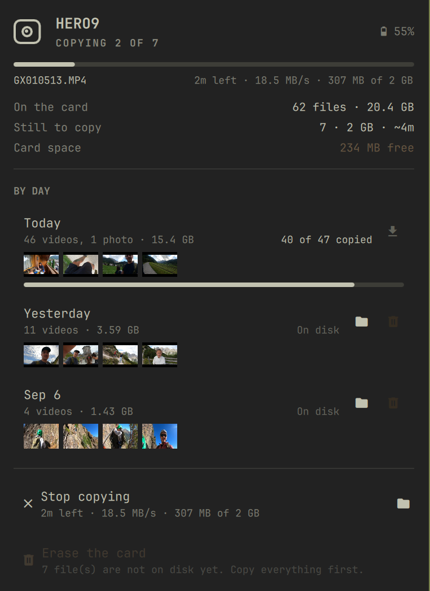

# GoPro for Omarchy

Copy photos and video off a USB-connected GoPro without a card reader, from
the Omarchy bar.



## Why this exists

A GoPro whose `Preferences → Connections → USB Connection` is set to GoPro
Connect does not appear as a storage device. It enumerates as a USB
CDC-Ethernet adapter, so no file manager on any OS will show it, and
`mtp-detect` finds nothing. The camera charges, the light comes on,
everything looks fine, and the files are unreachable.

What it does do in that mode is run an HTTP server. This plugin drives it.

MTP mode mounts the camera normally in a file manager, but it switches the
HTTP API off. You get one or the other, so pick.

## What it does

- Lists the card by day, with thumbnails from the camera's own proxies.
- Copies to `~/Pictures/GoPro/YYYY-MM-DD/`, keeping original filenames, photos
  and video together. The day comes from each file's creation time in local
  time.
- Runs transfers detached, so a multi-hour copy survives the panel closing,
  the bar reloading and the shell restarting.
- Reports live progress and an ETA computed from bytes, with per-day and
  whole-card progress bars.
- Deletes from the camera only after it has verified that same file
  byte-for-byte on disk.

Nothing is copied or deleted until you ask. Plugging a camera in gets you one
notification saying how much is waiting.

## Requirements

- Omarchy 4 (`omarchy-shell`, Quickshell)
- `python3`, standard library only, no pip packages
- `notify-send` (`libnotify`) for the connect and completion notifications
- `xdg-open` for the open-folder buttons

All four ship with a standard Omarchy install. The plugin bundles no binaries
and downloads nothing at install or run time. It talks to exactly one host,
the camera, on its link-local USB address.

## Install

```bash
omarchy plugin add https://github.com/jwahdatehagh/omarchy-gopro.git
omarchy plugin enable digital.1001.gopro
```

Plugins land disabled so you can read the code first.

## Remove

```bash
omarchy plugin remove digital.1001.gopro
```

That deletes the plugin checkout and drops its widget from the bar. To clear
what else it wrote:

```bash
rm -rf ~/.local/state/omarchy-gopro   # transfer job state and log
rm -rf ~/.cache/omarchy-gopro         # cached thumbnails
```

Removal never touches your archive in `~/Pictures/GoPro/`. Delete that
yourself if you want it gone.

## What it touches

- Media goes to the destination directory, `~/Pictures/GoPro/` by default.
- Job state goes to `~/.local/state/omarchy-gopro/`, thumbnails to
  `~/.cache/omarchy-gopro/`.
- Its settings sit in `~/.config/omarchy/shell.json` with every other
  widget's. Omarchy writes that file, not the plugin.

It edits no other configuration, needs no root and installs no services.

## Using it

Click the bar icon. Keys inside the panel:

| Key | Action |
|-----|--------|
| `s` | copy everything not yet on disk |
| `x` | stop a running copy |
| `r` | re-read the camera |
| `o` | open the archive |
| `e` | erase the card (asks first) |
| `↑` `↓` | move between days |
| `Enter` | copy that day, or open its folder when it is already complete |

Per-day buttons copy, open the folder, or remove that day from the camera.

## From the terminal

`gopro.py` is the whole implementation and runs standalone:

```bash
./gopro.py detect                 # is a camera reachable, and at what address
./gopro.py status                 # camera, card and archive state as JSON
./gopro.py sync --all             # detached copy; progress lands in job.json
./gopro.py sync --day 2026-09-08  # one day
./gopro.py job                    # live progress
./gopro.py cancel
./gopro.py verify                 # compares the archive against the manifest
./gopro.py delete --day 2026-09-08 --dry-run
./gopro.py format --dry-run
```

Destructive commands print what they would do and change nothing without
`--yes`.

## IPC

```bash
omarchy-shell gopro open|close|toggle|refresh|sync|cancel|status
omarchy-shell gopro erase          # opens the confirmation, never erases by itself
```

## Finding the camera

The camera derives its wired address from its serial number. The pattern is
`172.2X.1YZ.51`, where `X`, `Y` and `Z` are the last three digits. Serial
`…294` puts the camera on `172.22.194.51`. The plugin reads the serial from
the USB descriptor instead of hardcoding an address, and falls back to
scanning the CDC-Ethernet interface's subnet. Do not assume the host sits on
`.55`. DHCP moves it.

## What goes wrong, and what it does about it

Each of these cost something before it became a rule. Four clips vanished off
the card mid-session before anything had copied them. Two JPGs finished
truncated and looked complete.

- **A 403 on a download means "no such file", not "the media server is
  broken".** The plugin re-reads the manifest before concluding anything, then
  reports the file as gone rather than as an error. Reading it the other way
  once cost a pointless power cycle and a wrong diagnosis.
- **The card can change underneath a running transfer.** The plugin
  fingerprints the manifest, re-checks it every couple of minutes, drops
  files that disappeared from the remaining queue, and says so in the panel.
- **Downloads land in `<name>.part`.** The rename happens only when the byte
  count matches. An interrupted transfer left under its final name passes
  every later existence check, and you find out months later.
- **A file counts as copied only when it exists at exactly the manifest
  size.** Re-running then costs nothing, resumes where it stopped, and
  replaces anything truncated.
- **The camera keeps nothing the disk has not confirmed.** Comparing the
  filesystem against the manifest decides that, not the log.

Anything that exists only on the camera can disappear without warning. Copy it
before you rely on it.

## Speed

A HERO9 sustains 18.4 MB/s. That number comes from a 1.14 GB run whose files
came back byte-identical to earlier copies of the same clips. It is with turbo
transfer, which the plugin switches on for the length of a sync and off
afterwards. Without it the same link manages about 8.4 MB/s. Budget a minute
per gigabyte, so 19 GB takes around 17 minutes.

The camera's link is the bottleneck, not the disk. Your first estimate uses
the pessimistic 8.4 MB/s figure. After one completed transfer the panel
predicts from the rate that job actually hit.

## Settings

Destination, thumbnails per day, refresh interval, whether to hide the icon
when no camera is connected, and the two notification toggles. All in
Setup → Plugins.

## Tests

```bash
node --test tests/model.test.js
```

## Developing

The plugin lives in `~/.config/omarchy/plugins/digital.1001.gopro/`. A real
directory there hot-reloads when you save. If it is a symlink to a checkout
elsewhere, the shell's file watcher does not follow it, so run
`omarchy-restart-shell` after an edit.

## License

MIT.
